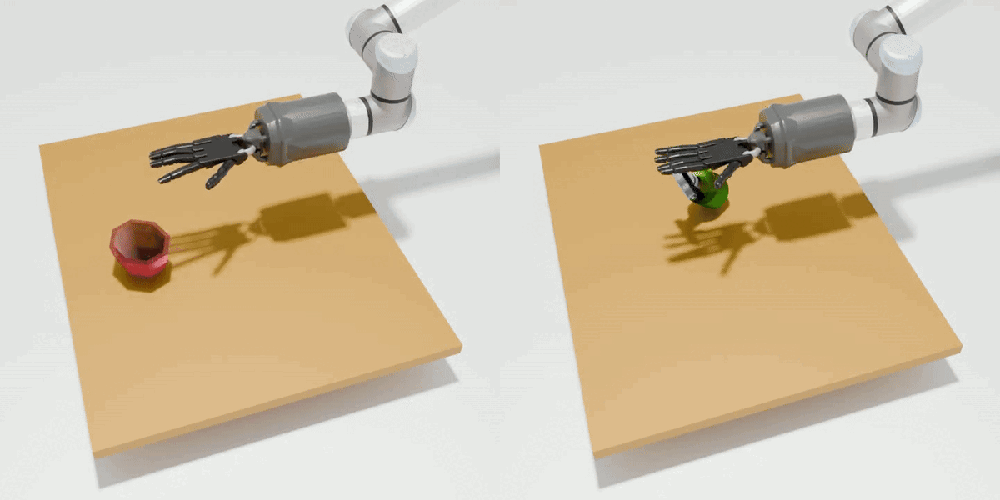
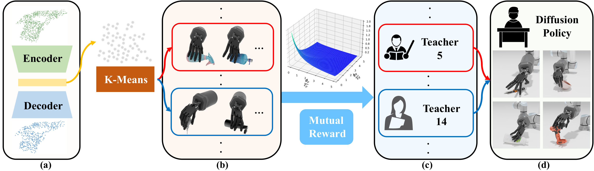

# Dexterous Functional Pre-Grasp Manipulation with Diffusion Policy

[](https://unidexfpm.github.io/)
[](https://arxiv.org/pdf/2403.12421)
[](https://github.com/Jiyao06/GenPose/blob/main/LICENSE)
<!-- [](https://hits.seeyoufarm.com) -->


This repo is the official implementation of [Dexterous Functional Pre-Grasp Manipulation with Diffusion Policy](https://arxiv.org/pdf/2403.12421).

## TODOs (Under Development):
- [ ] Point Cloud Pretraining
- [ ] Pose Clustering
- [ ] Expert Demo Collection
- [ ] Refactor

## Overview
 

In this paper, we focus on a task called **Dexterous Functional Pre-Grasp Manipulation** that aims to train a policy for controlling a robotic arm and dexterous hand to reorient and reposition the object to achieve the functional goal pose.

 

We propose a teacher-student learning approach that utilizes a novel mutual reward. Additionally, we introduce a pipeline that employs a mixture-of-experts strategy to learn diverse manipulation policies, followed by a diffusion policy to capture complex action distributions from these experts.

Contents of this repo are as follows:

- [Installation](#installation)
  - [Requirements](#requirements)
- [Dataset](#dataset)
  - [Asset](#asset)
  - [Functional Grasp Pose Dataset](#functional-grasp-pose-dataset)
- [Training](#training)
  - [Teacher](#teacher)
  - [Student](#student)
- [Evaluation](#evaluation)
- [Acknowledgement](#acknowledgement)
- [Citation](#citation)
- [Contact](#contact)
- [License](#license)


## Installation

### Requirements
The code has been tested on Ubuntu 20.04 with Python 3.8 and Pytorch 1.10.0. 

### Install

**IsaacGym**:

You can refer installation of IsaacGym [here](https://developer.nvidia.com/isaac-gym). We currently support the Preview Release 4 version of IsaacGym.

**IsaacGymEnvs**:

You can refer installation of IsaacGymEnvs [here](https://github.com/NVIDIA-Omniverse/IsaacGymEnvs).

**Other Dependencies**

python package:
``` 
rich 
pre-commit 
python-dotenv
skrl==0.10.2
ipdb
transforms3d
open3d
pytorch3d
diffusers
einops
zarr
numpy==1.21.6
trimesh
pycollada
```

## Dataset

### Asset
You can download object mesh from [DexFunPreGrasp/assets](https://drive.google.com/drive/folders/1gKqdrIu9GEYuV4FdRFeFCroRQ9OxL5MI?usp=sharing), put on following directory and extract.
```
assets
```
### Functional Grasp Pose Dataset
You can download filterd grasping dataset, human trajectories, and pointcloud buffer from [DexFunPreGrasp/datasets](https://drive.google.com/drive/folders/1gKqdrIu9GEYuV4FdRFeFCroRQ9OxL5MI?usp=sharing), put on following directory and extract.
```
data
```

## Training 

### Teacher

**Train Multiple Experts**

Currently we assume use the cluster we generated before, the total cluster number is 20. You can train each cluster by running the following shell, and change the "cluster" argument. We provide the **pretrained checkpoint** for each cluster in "ckpt".
```
sh ./train_expert.sh
```

**Expert Demonstrtation Collection**

After all the experts finished training, we need to collect demonstrations by running the following shell. **Please note there is issue with data collection, which we will fix later!!!**
```
sh ./collect_expert_demonstration.sh
```

**Create Expert Dataset**

We then create the expert dataset using the generated data by running the following shell. We provide the **generated dataset** on [DexFunPreGrasp/pose_datasets](https://drive.google.com/drive/folders/1gKqdrIu9GEYuV4FdRFeFCroRQ9OxL5MI?usp=sharing)
```
sh ./create_expert_dataset.sh
```

### Student
## Evaluation
```
sh ./eval_diffusion.sh
```
You can download pretrained checkpoint from [DexFunPreGrasp/pretrained_ckpt](https://drive.google.com/drive/folders/1gKqdrIu9GEYuV4FdRFeFCroRQ9OxL5MI?usp=sharing), and put to "ckpt" directory.

## Acknowledgement
The code and dataset used in this project is built from these repository:

Environment: 

[NVIDIA-Omniverse/IsaacGymEnvs](https://github.com/NVIDIA-Omniverse/IsaacGymEnvs)

[PKU-MARL/DexterousHands](https://github.com/PKU-MARL/DexterousHands)

Dataset: 

[OakInk](https://github.com/oakink/OakInk)

Diffusion:

[Diffusion Policy](https://github.com/real-stanford/diffusion_policy)

Clustering:

[PKU-EPIC/UniDexGrasp](https://github.com/PKU-EPIC/UniDexGrasp)

Sim-Web-Visualizer:

[NVlabs/sim-web-visualizer](https://github.com/NVlabs/sim-web-visualizer)

<!-- ## Citation
If you find our work useful in your research, please consider citing:
``` bash
@article{wu2023learning,
  title={Learning Score-based Grasping Primitive for Human-assisting Dexterous Grasping},
  author={Tianhao Wu and Mingdong Wu and Jiyao Zhang and Yunchong Gan and Hao Dong},
  booktitle={Thirty-seventh Conference on Neural Information Processing Systems},
  year={2023},
  url={https://openreview.net/forum?id=fwvfxDbUFw}
}
``` -->

## Contact
If you have any suggestion or questions, please feel free to contact us:

Yunchong Gan: [yunchong@pku.edu.cn](mailto:yunchong@pku.edu.cn)

[Tianhao Wu](https://tianhaowuhz.github.io/): [thwu@stu.pku.edu.cn](mailto:thwu@stu.pku.edu.cn)

[Hao Dong](https://zsdonghao.github.io/): [hao.dong@pku.edu.cn](mailto:hao.dong@pku.edu.cn)

## License
This project is released under the MIT license. See [LICENSE](LICENSE) for additional details.


